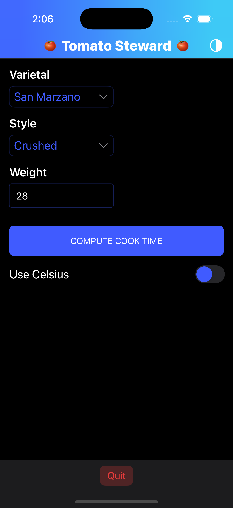

# Tomato Steward (iOS • Swift • CocoaPods • LaunchDarkly)

Tomato Steward computes a recommendation for how long to stew tomatoes and how much heat to use for optimal marinara flavor. The main objective with the app is to show how to use LaunchDarkly feature flags and context in an iOS app.  This app is not meant to be published to the app store, or have ci/cd setup.  It is just meant for a code example.

- Inputs: weight (oz), varietal, style
- Outputs: total time (minutes), heat guidance with temperatures in °F/°C, rationale, optional advanced tips

## Tech
- Swift 5.9+, iOS 16.0+
- MVVM with a small domain layer
- SwiftUI layout; MaterialComponents for styled controls
- LaunchDarkly SDK 9.x for feature flags with modern LDContext API
- Real-time flag observation with direct flag update functions
- Dark/Light mode support with branded adaptive colors
- Persistence via UserDefaults only

## Setup
1) Create an Xcode iOS App project named `TomatoSteward` (Swift, SwiftUI, iOS 16.0+), saved at the repo root.
2) Install pods:
```bash
cd .
pod install
open TomatoSteward.xcworkspace
```
3) Add your LaunchDarkly mobile SDK key:
   - Option A (preferred, no code changes): In Xcode, select Product → Scheme → Edit Scheme… → Run → Arguments → Environment Variables, then add:
     - `LD_MOBILE_KEY = <your_key>`
   - Option B (Info.plist): Add an Info.plist key `LD_MOBILE_KEY` with your key value.
   - Option C (environment alternative): set `LAUNCHDARKLY_SDK_KEY` in the Run scheme’s Environment Variables.
   The app will read `LD_MOBILE_KEY` from Info.plist, `LD_MOBILE_KEY` env var, then `LAUNCHDARKLY_SDK_KEY` env var (first non-empty wins).

4) Build the app in xCode and use the simulator.  Logging is set to show the default values of the feature flags.

## Feature Flags (keys and defaults)
- `algo.reductionModel` (string) — default "v1"; "v2" enables alternate stewing algorithm
- `ui.showAdvancedTips` (bool) — default false; shows additional cooking tips in results
- `ui.enableLogin` (bool) — default false; future login functionality  
- `units.defaultCelsius` (bool) — default false; sets temperature unit preference
- `ui.showUnitsToggle` (bool) — default false; displays Celsius/Fahrenheit toggle in UI
- `ui.DarkMode` (bool) — default false; true=dark mode with branded colors, false=light mode

All flags use real-time observation with immediate UI updates. Each flag has dedicated update functions in `LaunchDarklyService.swift` following the direct observation pattern with proper logging.

## LaunchDarkly Implementation Details

### SDK Integration (v9.x)
- Uses `LDContext` API instead of deprecated `LDUser`
- Context auto-generates device attributes with `autoEnvAttributes: .enabled`
- 30-second startup timeout with `startWaitSeconds: 30`
- Individual `@Published` properties for each flag enable SwiftUI reactivity

### Direct Observation Pattern
```swift
// Example flag observation
client.observe(key: "ui.DarkMode", owner: self) { [weak self] changedFlag in
    guard let me = self else { return }
    guard case .bool(let value) = changedFlag.newValue else { return }
    me.updateDarkMode(flagKey: changedFlag.key, value: value, isChange: true)
}
```

### Flag Update Functions
Each flag has a dedicated update function that:
- Handles immediate state changes (UI, branding, etc.)
- Logs flag changes with specific emojis (`! 🌙` for dark mode changes)
- Updates `@Published` properties for SwiftUI reactivity
- Follows the official LaunchDarkly iOS example pattern

## Algorithm Summary
Baseline (v1): time = 30 * (weight_oz / 28)^0.85 * varietalFactor * styleFactor

Alternate (v2): time = 28 * (weight_oz / 28)^0.90 * (varietalFactor * 1.03) * styleFactor

Clamp 20…120 minutes. If time < 35 → Low Simmer (≈185–200°F / 85–93°C), else Medium Simmer (≈195–205°F / 90–96°C).

## UI Features

### Dark Mode Support
- Adaptive branding colors that change with `ui.DarkMode` flag
- Branded `Color(light:dark:)` and `UIColor` extensions
- Immediate theme switching via `Brand.enableDarkMode()` / `Brand.enableLightMode()`
- Theme menu appears in navigation bar when dark mode is active

### Modern SwiftUI Layout (iOS 16.0+)
- Bottom toolbar with grey background for Quit button
- Material design text fields with focus handling
- Custom number pad for simulator compatibility
- Responsive layout with keyboard management

### Flag-Driven UI Elements
- Units toggle shows/hides based on `ui.showUnitsToggle` flag
- Theme menu visibility controlled by `ui.DarkMode` flag state
- All UI elements reactively update via `@ObservedObject` pattern

## Persistence
- `lastInputs` (JSON-encoded `StewInputs`)
- `preferredUnits` ("F"/"C")
- `device_uuid` (for LaunchDarkly context consistency)

## Notes
- Uses SwiftUI App lifecycle with `App/TomatoStewardApp.swift` as main entry point. This file handles app initialization & global configuration. Other iOS repos may have `AppDelegate.swift` as their main entry if they are using the traditional UIKit approach.
- LaunchDarkly integration handled in `Services/LaunchDarklyService.swift`
- Individual flag update functions provide clean separation of concerns
- Real-time flag changes demonstrated through immediate UI updates

## Screenshots

*Demonstrating default flag states*


*Demonstrating some enabled flag states*


*Demonstrating advanced tips, currently the user must recalculate the cooktime for this to show when enabled*